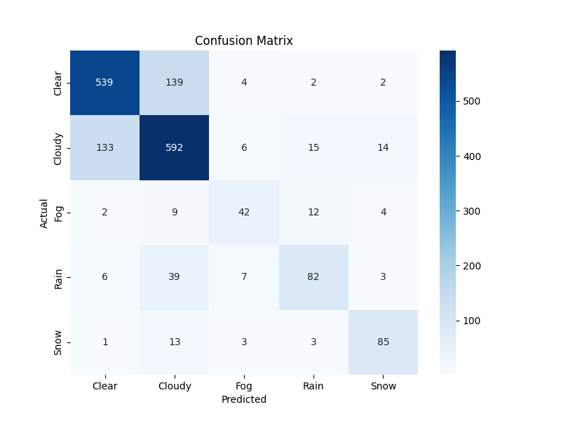

Perfect ✅ — I’ll update your **README.md** to include a **Screenshots** section with these images.
Here’s the improved version:

---

```markdown
# 🌦 Weather Prediction

## 📌 Overview
This project is a **machine learning–powered weather classification app** built with **Python, scikit-learn, and Streamlit**.  
It predicts weather conditions based on temperature, humidity, wind speed, pressure, and other engineered features.  
The app is interactive, allowing users to input weather parameters and get real-time predictions with confidence scores.

---

## ✨ Features
- ✅ Real-time weather prediction from user inputs  
- ✅ Advanced feature engineering (time-based & interaction features)  
- ✅ Clean, interactive UI with **Streamlit**  
- ✅ Modular, well-structured Python code for preprocessing, training, and evaluation  
- ✅ Excludes *Snow* and *Fog* predictions for more relevant results  

---

## 📂 Project Structure

```plaintext
weather_prediction_project/
├── 📄 app.py                     # Streamlit app for predictions
├── 📄 requirements.txt           # Python dependencies
├── 📄 README.md                   # Project documentation
├── 📂 data
│   ├── 📂 raw
│   │   └── 📄 Weather_Dataset.csv   # Original dataset
│   ├── 📂 processed
│   │   ├── 📄 processed_data.csv
│   │   └── 📄 engineered_data.csv
├── 📂 src
│   ├── 📄 preprocessing.py
│   ├── 📄 feature_engineering.py
│   ├── 📄 model_training.py
│   └── 📄 evaluation.py
├── 📂 models
│   ├── 📄 trained_model.pkl
│   └── 📄 confusion_matrix.png
├── 📂 notebooks
│   └── 📄 exploratory_data_analysis.ipynb


---

## 🚀 Installation

1️⃣ Clone the repository:
```bash
git clone https://github.com/Tejas-I-M/weather-prediction.git
cd weather_prediction_project
````

2️⃣ Install dependencies:

```bash
pip install -r requirements.txt
```

3️⃣ Run the Streamlit app:

```bash
streamlit run app.py
```

---

## 📊 Model Information

* **Algorithm:** RandomForestClassifier (or your chosen ML model)
* **Features Used:**

  * Temperature (°C)
  * Dew Point Temperature (°C)
  * Relative Humidity (%)
  * Wind Speed (km/h)
  * Visibility (km)
  * Pressure (kPa)
  * Hour of Day
  * Month & Day of Week
  * Is\_Night (binary feature)
  * Temp\_Diff (temperature - dew point)
  * Humidity × Visibility interaction
* **Excluded Labels:** Snow, Fog

---

## 🎯 Example Prediction

| Temperature | Humidity | Wind Speed | Pressure | Prediction | Confidence |
| ----------- | -------- | ---------- | -------- | ---------- | ---------- |
| 25°C        | 65%      | 12 km/h    | 101 kPa  | Clear      | 92.4%      |

---

## 📸 Screenshots

### 1. Confusion Matrix



---

### 2. Streamlit App UI


---

## 📜 License

This project is licensed under the MIT License — you are free to use, modify, and distribute it with attribution.

---

## 📬 Contact

**Author:** Tejas I M
**GitHub:** [Tejas-I-M](https://github.com/Tejas-I-M)
**Email:** [rex91320@gmail.com](mailto:rex91320@gmail.com)

---


 


